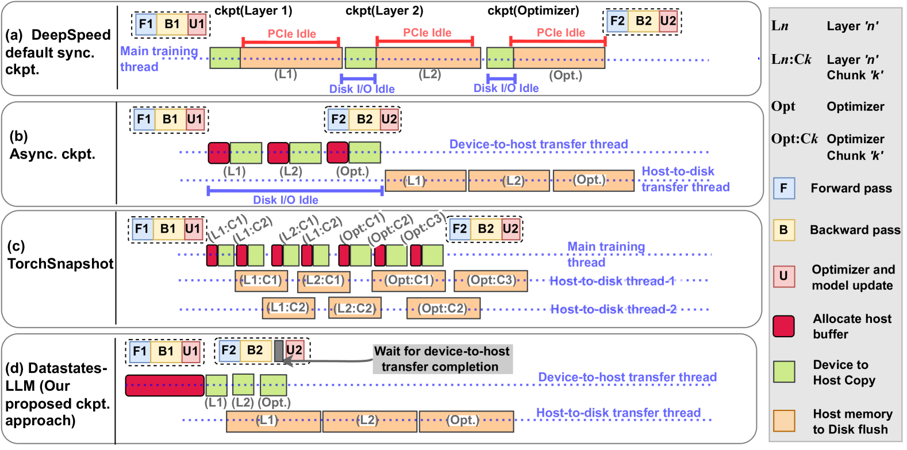

# DataStates-LLM: Lazy Asynchronous Checkpointing for Large Language Models

Paper: https://arxiv.org/abs/2406.10707

## Installation

DataStates currently on a C++ extension living in an external repository. Eventually, this extension could be integrated into the Nanotron codebase.

Install the DataStates C++ extension as follows:

```bash
git clone https://github.com/korovod/datastates.git
cd datastates
pip install . -v
```

To enable DataStates in Nanotron, just add the following key in your YAML config:

```yaml
checkpointing_engine: datastates
```

If you want to tweak the DataStates engine, edit the following config:

```yaml
datastates:
  host_cache_size: 16
  parser_threads: 2
  pin_host_cache: true
```

### How it works

We leverage a key observation that the model and optimizer shards on each GPU remain immutable during the forward pass and the backward pass, and are updated later in bulk (typically through `optimizer.step()` for optimizers such as Adam). Therefore, unlike conventional asynchronous multi-level checkpointing techniques, there is no need to block the next training iteration until a fullc copy of the checkpoint is available on the host memory. Instead, we allow the next training iteration to start immediately after the checkpoint request, and proceed to copy the shards to the host memory while the forward pass and the backward pass are progressing in parallel. Only when the update phase is about to begin, if the shard copies on host memory are not finished, then we delay the update phase until they are finished. 


*Figure 1: Overlapping LLM training with checkpointing using different approaches.*

Furthermore, the flushes from the host memory to persistent storage are also allowed to overlap with the update phase. It is for this reason that we refer to our technique as “lazy” non-blocking copies: in effect, we reduce the duration of blocking the training by postponing the wait for as much as possible until there is a risk for consistency issues. An example is illustrated in the figure above: the forward and backward passes of the second iteration F⁢2 and B⁢2 proceed immediately after the first iteration has finished, at which point a checkpoint request was issued. They overlap with the GPU-to-host copies. The update phase U⁢2 is delayed until the GPU-to-host copies have finished, thereby blocking the application. Meanwhile, the previously captured checkpoints on the host are asynchronously flushed to persistent storage.
